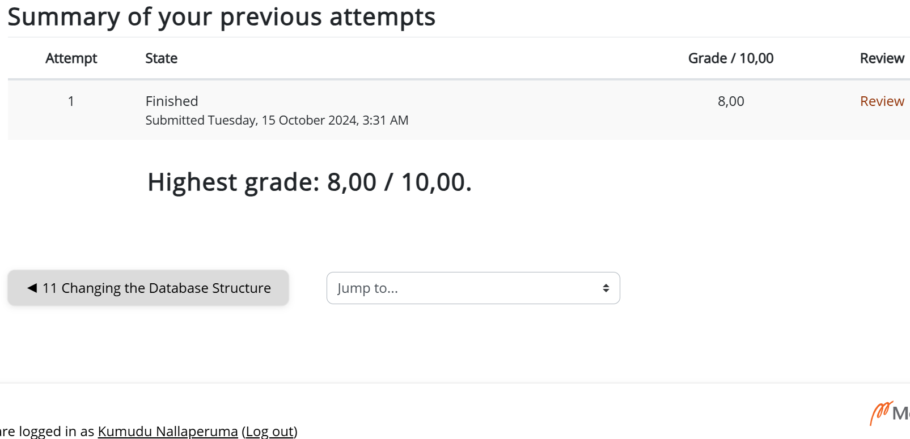
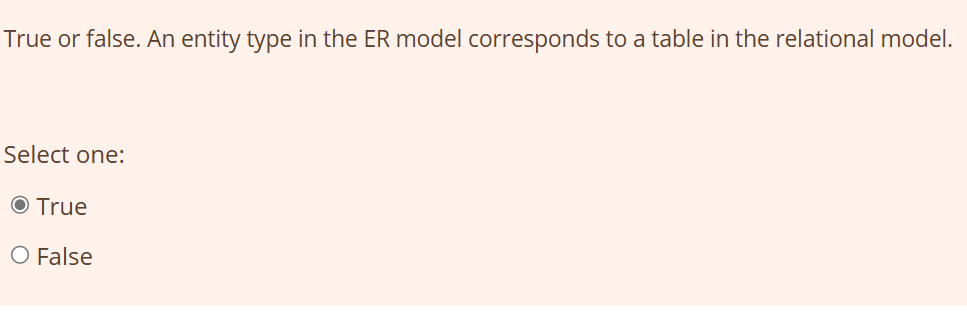
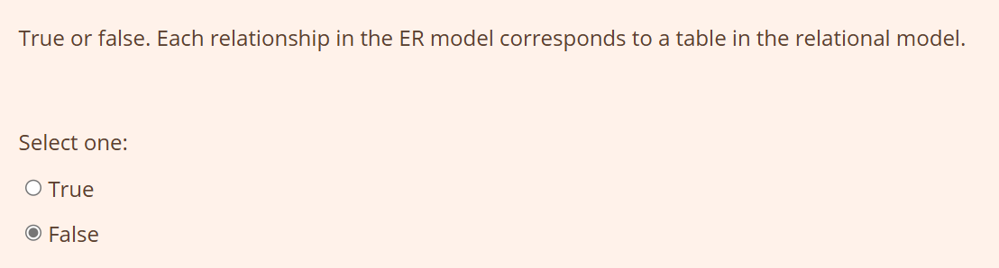
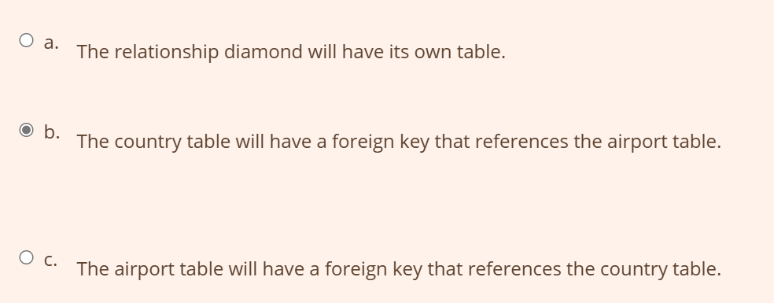
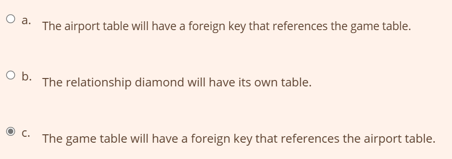
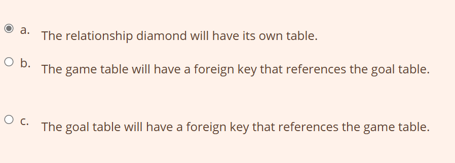
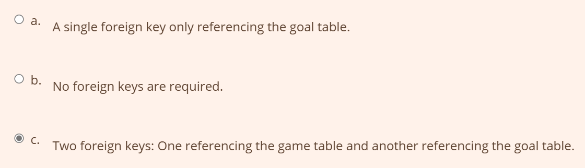

# Software 2

## Week 1

### Exercise 8 - Database Design

### grade

### Question 1

### Question 2

### Question 3

### Question 4

### Question 5

### Question 6

### Question 7

### Question 8 

### Question 9

### Question 10

